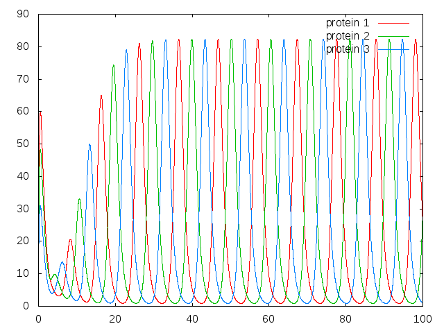

AmiMe
====

AmiMe is a package to simulate a Network Dynamics.

For example, gene reguratory network, metabolic network or neural network.

## Examples

### Repressilator

## For developpers

## Testing

## Licensing Terms
This project is licensed under the terms of the MIT License.
See LICENSE for the project license.

- Copyright (c) 2016 Toru Niina

All rights reserved.
